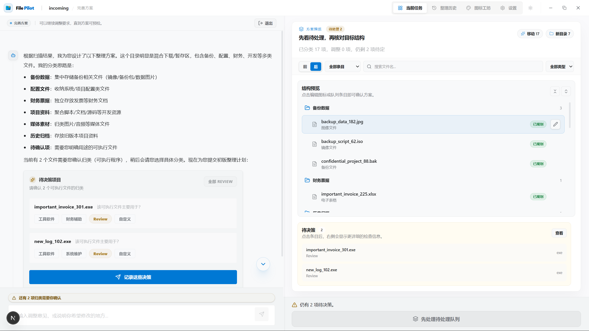

<div align="center">
  

  <h1>FilePilot</h1>

  <p>面向 Windows 的本地 AI 文件整理工作台</p>

  <p>
    
    
    
    
    
  </p>

  <p>
    <a href="#项目简介">项目简介</a> |
    <a href="#主要功能">主要功能</a> |
    <a href="#界面截图">界面截图</a> |
    <a href="#快速开始">快速开始</a> |
    <a href="#使用提醒">使用提醒</a> |
    <a href="#限制说明">限制说明</a> |
  </p>

</div>

---

## 项目简介

FilePilot 用于整理本地目录：先扫描和分析，再生成整理方案，确认后执行，并支持查看历史和回退最近一次执行。

适合这些场景：

- 下载目录、桌面、素材目录长期堆积，需要重新归类和整理

## 主要功能

- 扫描目录并生成整理方案
- 支持 `初次整理` 与 `增量归档` 两种整理模式
- 执行前预检，确认风险和冲突
- 执行文件移动
- 保存执行历史，并支持最近一次执行回退
- 为文件夹生成、应用和恢复图标

## 设计理念：建筑式工作台 (Architectural Workbench)

FilePilot 并非传统的“网页式”应用，其设计遵循桌面端生产力工具的逻辑：

- **高密度布局**：最大化利用屏幕空间，移除冗余的修饰性元素，让用户一眼看到更多任务信息。
- **结构化环境**：界面像建筑平面图一样精确、冷静，通过色阶分区（Surface-based）而非硬边框来划分功能块。
- **低疲劳交互**：采用 Manrope 和 Inter 字体组合，优化中文排版，确保长时间使用的视觉舒适度。
- **任务中心**：避免“官网式”大图与营销文案，首屏即工具，操作即反馈。

详情请参考 [DESIGN.md](./DESIGN.md)。

## 界面截图




## 快速开始

### 安装方式

前往 GitHub Releases 下载桌面安装包，安装后直接运行。

### 首次使用

1. 打开应用
2. 在设置中填写模型服务和 API Key
3. 选择要整理的目录
4. 先查看整理方案和预检结果
5. 确认无误后再执行整理

## 使用提醒

- 只对适合整理的目录使用，例如下载目录、桌面、素材暂存目录
- 不要直接对系统目录、开发环境目录、同步盘根目录或正在频繁变化的工作目录执行整理
- 第一次使用时，建议先拿测试目录或低风险目录试跑
- 执行前先检查整理方案和预检结果，再决定是否继续

## 整理模式

### 初次整理

- 面向首次整理的杂乱目录
- 作用范围是当前目录的一层条目
- 允许新建目录并生成新的整理结构
- 扫描完成后会自动进入规划阶段

### 增量归档

- 面向已经有基础结构的目录，处理后续新增的零散内容
- 当前层文件和目录会先进入“候选源列表”，需要用户手动勾选本次要归档的条目
- 系统会额外建立“已有目标目录索引”，允许把当前层条目归入已有的二级或三级目录
- 目标目录可见深度支持 `1-3`，默认 `2`
- 增量模式下不允许新建目录、不允许目录改名、不允许重组未选中的既有结构

### 当前语义边界

- 两种模式都仍以“当前目录一层条目”为可执行移动对象
- 即使在增量模式中，深层目录下的文件也不会被拆成独立计划项
- 增量模式扩展的是“目标结构可见范围”，不是“递归整理范围”

## 限制说明

- 目前只支持 Windows 环境
- 需要用户自行配置模型服务和 API Key
- 文件分析结果会受到模型能力和接口稳定性影响
- 图标生成功能依赖额外模型配置
- 建议整理的目录文件数不超过600（需要视具体模型和上下文窗口而定）, 并且需要能够稳定使用`tool_call` , 推荐接入较强的文本模型。

## 本次改动记录

### 会话与 API

- 会话策略新增 `organize_mode` 和 `destination_index_depth`
- 会话阶段新增 `selecting_incremental_scope`
- `session_snapshot` 新增 `incremental_selection`
- 新增接口 `POST /api/sessions/{session_id}/incremental-selection`

### 扫描与规划

- `initial` 模式保持当前层扫描后自动规划
- `incremental` 模式扫描后先进入范围确认，不会自动触发规划
- 增量模式会生成：
  - 当前层候选源列表
  - 目标目录索引
- 规划输入统一升级为：
  - `item_id | entry_type | display_name | source_relpath | suggested_purpose | summary`
- 提示词和计划校验已按模式分流：
  - `initial`：要求覆盖当前规划范围，可新建目录
  - `incremental`：只允许处理已选条目，只能投递到索引目录，禁止目录改名和新建目录

### 前端工作台

- 启动页新增“初次整理 / 增量归档”模式切换
- 仅在增量模式下显示“目标目录可见深度”
- 工作台新增增量候选选择视图，支持多选、全选、清空和确认范围
- 恢复增量会话时，如果范围未确认，会直接回到候选选择阶段

### 当前验证结果

- 已通过：
  - `python -m unittest tests.test_structured_organizer_service -v`
  - `python -m unittest tests.test_api_sessions -v`
  - 增量模式相关 `tests.test_session_service` 定向用例
  - `Set-Location frontend; npm run typecheck`
- 已知事项：
  - `tests.test_session_service` 全模块在 Windows 下仍有既存的日志文件句柄清理问题，整模块跑法不稳定；功能相关定向用例已完成验证

## 开发

项目统一入口和常用命令保留在这里；更细的桌面宿主与前端约定分别见 [desktop/README.md](desktop/README.md) 和 [frontend/README.md](frontend/README.md)。

### 常用命令

```powershell
python -m unittest discover -s tests -p "test_*.py"

Set-Location frontend
npm run typecheck
npm test

Set-Location ..\desktop\src-tauri
cargo check
```

### 推荐开发流程

1. 先运行 `python -m file_organizer.api`
2. 前端开发时在 `frontend/` 运行 `npm run dev`
3. 提交前至少执行相关 `unittest` 和 `npm run typecheck`
4. 如涉及桌面端，再补跑 `cargo check` 或 `npm run tauri:dev`


## License

[MIT](./LICENSE)
