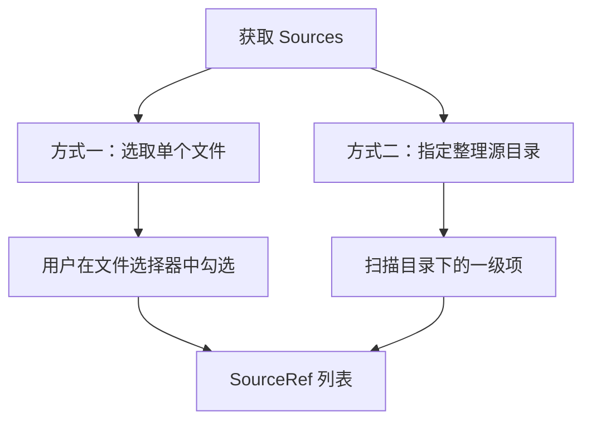
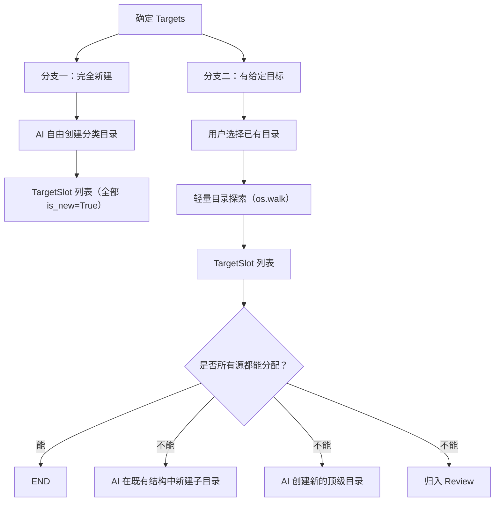
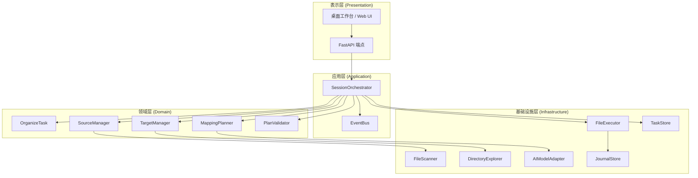

# FilePilot 未来架构设计

> 本文档是一份长期架构蓝图，基于对当前系统的审计和对核心领域的重新理解而编写。
> 用于指导后续迭代，不要求一次性实现。

---

## 一、领域本质

**文件整理的本质是一个分配问题**：

```
给定一组待整理的文件（Sources），
和一组目标容器（Targets），
生成一个映射（Mapping），
然后执行这个映射。
```

系统中的一切复杂性——扫描、AI 规划、对话、预检、执行、回退——都是围绕这四个名词展开的。

### 当前系统与领域本质的错位

| 领域概念 | 当前系统的实现 | 问题 |
|---------|-------------|------|
| **Sources** | `target_dir` 下的扫描结果（`scan_lines`） | 假设源文件只在单一目录下；扫描和源定义耦合 |
| **Targets** | `indexed_directories`（被动生成的路径列表） | 不是一等公民；用户无法主动定义；用裸路径给模型 |
| **Mapping** | `PendingPlan.moves`（`source → target` 路径对） | 合理，但路径直接暴露给模型，缺少 ID 抽象层 |
| **Execution** | `ExecutionPlan` + `ExecutionJournal` | 设计良好，但绑定了 `base_dir` 单根假设 |

### 新架构应遵循的原则

1. **Sources 和 Targets 是独立的一等公民** — 它们的获取、扫描、展示应该完全解耦
2. **模型操作 ID，系统操作路径** — AI 看到 `F003 → D002`，系统负责翻译成文件系统操作
3. **模式是参数，不是分叉** — "初始整理"和"增量整理"是同一个流程的不同配置
4. **流程是线性的** — Setup → Analyze → Plan → Review → Execute → Done

---

## 二、核心领域模型

### 2.1 SourceRef — 待整理项引用

```python
@dataclass
class SourceRef:
    """一个待整理的文件或目录的引用"""
    ref_id: str           # 稳定 ID，如 "F001"
    display_name: str     # 展示名，如 "报告_Q1.pdf"
    entry_type: str       # "file" | "directory"
    origin: str           # 来源根路径，如 "D:/Downloads"
    relpath: str          # 相对于 origin 的路径，如 "报告_Q1.pdf"
    
    # 分析结果（扫描后填充）
    suggested_purpose: str = ""
    content_summary: str = ""
    confidence: float | None = None
    
    # 元数据
    size_bytes: int | None = None
    modified_at: str | None = None
    ext: str = ""

    @property
    def absolute_path(self) -> Path:
        return Path(self.origin) / self.relpath
```

**与当前 `planner_items` 的关系**：`SourceRef` 是 `planner_items` 的演化版本，核心区别是引入了 `origin` 字段，使其不再假设所有文件来自同一个根目录。

**来源获取方式**（Step 1 的两个分支）：



### 2.2 TargetSlot — 目标容器

```python
@dataclass
class TargetSlot:
    """一个目标分类目录"""
    slot_id: str          # 稳定 ID，如 "D001"
    display_name: str     # 语义名，如 "学习资料"
    real_path: str        # 真实系统路径，如 "D:/资料库/学习资料"
    
    # 结构信息
    children: list[TargetSlot] = field(default_factory=list)
    depth: int = 0
    
    # 状态
    is_new: bool = False  # 是否由 AI 新建（执行前不存在）
```

**ID 映射表（对模型可见的格式）**：

```
可用目标目录：
| 目录名 | ID |
| 学习资料 | D001 |
| 学习资料/数学 | D002 |
| 学习资料/英语 | D003 |
| 项目文件 | D004 |
| 项目文件/FilePilot | D005 |
```

> 真实系统路径（`D:\resource information\学习资料`）只存在于系统内部，模型永远不需要接触。

**来源获取方式**（Step 2 的两个分支）：



### 2.3 MappingEntry — 分配映射

```python
@dataclass
class MappingEntry:
    """一条「源 → 目标」的分配记录"""
    source_ref_id: str    # 如 "F003"
    target_slot_id: str   # 如 "D002"，空字符串表示留在原位
    status: str           # "assigned" | "unresolved" | "review" | "skipped"
    reason: str = ""      # AI 给出的归类理由
    confidence: float | None = None
    
    # 用户覆盖标记
    user_overridden: bool = False  # 用户手动调整过，AI 不再自动修改
```

**与当前 `PlanMove` 的对比**：

| 维度 | `PlanMove`（当前） | `MappingEntry`（新） |
|------|-------------------|---------------------|
| 引用方式 | `source: str`（文件路径） | `source_ref_id: str`（ID） |
| 目标引用 | `target: str`（包含文件名的完整路径） | `target_slot_id: str`（目录 ID） |
| 文件名 | 拼接在 target 里 | 系统自动保留原名，不在映射中体现 |
| 用户锁定 | 无 | `user_overridden` 标志 |

### 2.4 OrganizeTask — 整理任务（替代 OrganizerSession 的领域核心）

```python
@dataclass
class OrganizeTask:
    """一次整理任务"""
    task_id: str
    
    # 三大领域对象
    sources: list[SourceRef]
    targets: list[TargetSlot]
    mappings: list[MappingEntry]
    
    # 策略配置
    strategy: StrategyConfig
    
    # 约束
    user_constraints: list[str]
    
    # 状态
    phase: TaskPhase  # setup | analyzing | planning | reviewing | executing | done
```

这是整个系统的**聚合根**。当前的 `OrganizerSession` 混合了领域逻辑（plan、moves）、UI 状态（messages、assistant_message）、基础设施状态（scanner_progress）。新设计将这些关注点分离：

```
OrganizeTask          — 领域核心（纯数据，可序列化）
├── sources           — 待整理项
├── targets           — 目标结构
└── mappings          — 分配方案

SessionState          — UI / 交互状态
├── messages          — 对话历史
├── assistant_message — 最新 AI 回复
├── scanner_progress  — 扫描进度
└── planner_progress  — 规划进度

ExecutionContext       — 执行上下文
├── journal           — 执行日志
├── precheck          — 预检结果
└── rollback_info     — 回退信息
```

---

## 三、系统分层架构



### 各层职责

| 层 | 职责 | 不应该做的事 |
|----|------|------------|
| **表示层** | 渲染 UI、处理用户交互、HTTP 序列化 | 不含业务逻辑 |
| **应用层** | 编排工作流、管理会话生命周期、协调领域服务 | 不直接操作文件系统 |
| **领域层** | 定义核心数据结构、校验业务规则、生成映射 | 不依赖具体 IO 实现 |
| **基础设施层** | 文件扫描、目录探索、AI 调用、文件移动 | 不包含业务判断 |

### 与当前代码的映射

| 新架构组件 | 对应当前代码 | 变化 |
|-----------|------------|------|
| `SessionOrchestrator` | `OrganizerSessionService`（3100+ 行） | 拆分，只留编排逻辑 |
| `SourceManager` | `_build_planner_items`, `_scan_entries`, `_build_incremental_candidates` | 提取为独立服务 |
| `TargetManager` | `_build_destination_index`, `_explore_target_directories` | 提取为独立服务 |
| `MappingPlanner` | `organize/service.py` 的 `chat_one_round` + prompt 构建 | 接口不变，输入格式升级 |
| `PlanValidator` | `_validate_incremental_target`, precheck 相关 | 提取，支持更灵活的规则 |
| `FileScanner` | `analysis/service.py` | 基本不变 |
| `DirectoryExplorer` | `_build_destination_index`（当前是 `os.walk`） | 提取为独立组件 |
| `FileExecutor` | `execution/service.py` | 需要支持多根路径 |

---

## 四、统一的工作流

### 4.1 阶段定义

```python
class TaskPhase(str, Enum):
    SETUP = "setup"           # 用户配置源和目标
    ANALYZING = "analyzing"   # 扫描源文件，探索目标结构
    PLANNING = "planning"     # AI 生成映射方案 + 用户对话调整
    REVIEWING = "reviewing"   # 预检通过，等待用户最终确认
    EXECUTING = "executing"   # 正在执行文件移动
    DONE = "done"             # 完成（含部分失败的情况）
```

**与当前阶段的对照**：

```
当前                           新
────                           ───
draft                    →     setup
scanning                 →     analyzing
selecting_incremental_scope →  setup（的子步骤，不再是独立阶段）
planning                 →     planning
ready_for_precheck       →     planning（预检变成 planning 内的操作）
ready_to_execute         →     reviewing
executing                →     executing
completed                →     done
abandoned / stale / interrupted → 通过 task.status 标记，不再是 phase
```

**核心简化**：去掉了 `selecting_incremental_scope` 这个仅在增量模式下出现的独立阶段。目标选择统一纳入 `setup` 阶段，不管是初始还是增量。

### 4.2 统一流程图

```mermaid
stateDiagram-v2
  [*] --> Setup
  
  state Setup {
    [*] --> CollectSources
    CollectSources --> CollectTargets
    CollectTargets --> [*]
    
    note right of CollectSources
      方式A: 用户选择单个文件/目录（拖放、浏览器）
      方式B: 用户指定一个源目录（扫描其一级内容）
    end note
    
    note right of CollectTargets
      方式A: 用户选择已有目标目录 → 轻量探索
      方式B: 不指定（AI完全新建）
      方式C: 混合（部分已有 + AI补充）
    end note
  }
  
  Setup --> Analyzing: 用户确认配置
  
  state Analyzing {
    [*] --> ScanSources
    ScanSources --> ExploreTargets
    ExploreTargets --> [*]
    
    note right of ScanSources
      对每个 SourceRef 调用分析服务
      生成 suggested_purpose、content_summary
      复用现有的 analysis/service.py
    end note
    
    note right of ExploreTargets
      对每个用户选定的目标目录做 os.walk
      生成 TargetSlot 树
      分配 slot_id（D001, D002...）
      瞬间完成，无需 AI
    end note
  }
  
  Analyzing --> Planning: 扫描完成
  
  state Planning {
    [*] --> AIGeneratesMapping
    AIGeneratesMapping --> UserReviews
    UserReviews --> AIAdjusts: 用户要求调整
    AIAdjusts --> UserReviews
    UserReviews --> RunPrecheck: 用户满意
    RunPrecheck --> [*]: 预检通过
    RunPrecheck --> UserReviews: 预检有阻塞
  }
  
  Planning --> Reviewing: 预检通过
  Reviewing --> Executing: 用户输入 YES
  Executing --> Done: 执行完成
  Done --> [*]
```



### 4.3 "初始整理"与"增量整理"的统一

在新架构下，这两者的区别只是 `setup` 阶段的配置不同：

```python
# 场景一：全量整理（当前的 initial 模式）
task.sources = scan_directory("D:/Downloads")  # 目录下所有一级项
task.targets = []                              # 空，AI 完全新建

# 场景二：增量整理（当前的 incremental 模式）
task.sources = scan_directory("D:/Downloads", exclude=["文档", "项目"])
task.targets = explore_directories(["D:/Downloads/文档", "D:/Downloads/项目"])

# 场景三：跨目录整理（当前系统不支持）
task.sources = [
    pick_files("C:/Users/Desktop/report.pdf"),
    pick_files("D:/temp/design.fig"),
    scan_directory("E:/camera_import"),
]
task.targets = explore_directories(["D:/资料库"])

# 场景四：多目标整理（当前系统不支持）
task.sources = scan_directory("D:/Downloads")
task.targets = explore_directories([
    "D:/工作文件",
    "E:/个人归档",
    "F:/NAS/共享",
])
```

**不再需要 `organize_mode` 字段**。系统根据 `targets` 是否为空来自动调整行为。

---

## 五、ID 体系

### 5.1 设计原则

- **模型看到的都是 ID**，系统负责 ID ↔ 路径的双向翻译
- **ID 是会话内唯一的**，不需要全局唯一
- **ID 是人可读的**，方便调试

### 5.2 ID 分配规则

| 对象 | 前缀 | 格式 | 示例 |
|------|------|------|------|
| 源文件 | `F` | `F{NNN}` | `F001`, `F042` |
| 目标目录 | `D` | `D{NNN}` | `D001`, `D015` |
| 特殊目录 | 无 | 保留名 | `Review`（待核对暂存） |

### 5.3 模型交互格式

**当前给模型的格式**（scan_lines）：
```
F001 | file | 报告_Q1.pdf | 报告_Q1.pdf | 财务报表 | 第一季度财务数据汇总
F002 | dir  | camera_import | camera_import | 照片集 | 手机导入的照片
```

**新增给模型的目标目录格式**：
```
可用目标目录：
D001 | 文档
D002 | 文档/财务报告
D003 | 文档/合同
D004 | 项目
D005 | 项目/UI设计
D006 | 归档
D007 | 归档/照片/2026
```

**模型的工具调用变化**：

```diff
 # submit_plan_diff.move_updates (当前)
-{ "item_id": "F001", "target_dir": "文档/财务报告" }

 # submit_plan_diff.move_updates (新)
+{ "item_id": "F001", "target_slot": "D002" }
+# 或者需要新建子目录时：
+{ "item_id": "F002", "target_slot": "D006", "sub_path": "照片/旅行" }
```

### 5.4 ID 翻译层

```python
class IdRegistry:
    """管理 F-ID ↔ SourceRef 和 D-ID ↔ TargetSlot 的双向映射"""
    
    def __init__(self):
        self._sources: dict[str, SourceRef] = {}   # F001 → SourceRef
        self._targets: dict[str, TargetSlot] = {}   # D001 → TargetSlot
    
    def resolve_source(self, ref_id: str) -> Path:
        """F001 → 真实文件系统路径"""
        ref = self._sources[ref_id]
        return Path(ref.origin) / ref.relpath
    
    def resolve_target(self, slot_id: str, filename: str, sub_path: str = "") -> Path:
        """D002 + "report.pdf" + "2026/" → 真实目标路径"""
        slot = self._targets[slot_id]
        base = Path(slot.real_path)
        if sub_path:
            base = base / sub_path
        return base / filename
    
    def register_new_target(self, display_name: str, parent_slot_id: str | None, real_path: str) -> str:
        """AI 新建目录时，动态分配新的 D-ID"""
        next_id = f"D{len(self._targets) + 1:03d}"
        self._targets[next_id] = TargetSlot(
            slot_id=next_id,
            display_name=display_name,
            real_path=real_path,
            is_new=True,
        )
        return next_id
```

---

## 六、关键场景的数据流

### 场景：增量整理（最常见的场景）

```
用户操作                    系统内部                         模型视角
────────                    ────────                         ────────
1. 选择源目录               SourceManager.scan(dir)           —
   "D:/Downloads"           → 生成 SourceRef 列表
                            → 分配 F001~F015

2. 选择目标目录             TargetManager.explore(dirs)         —
   ["文档", "项目"]         → os.walk 读目录树
                            → 分配 D001~D012
                            → 待整理项 = 一级项 - 目标目录

3. 确认，开始扫描           FileScanner.analyze(sources)        —
                            → 填充 suggested_purpose
                            → 填充 content_summary

4. 自动进入规划             MappingPlanner.generate()           收到:
                                                              - 源列表 (F001~F015)
                                                              - 目标列表 (D001~D012)
                                                              返回:
                                                              - F001 → D003
                                                              - F002 → D007
                                                              - F003 → Review

5. 用户在 UI 上微调         task.mappings 更新                  —
   拖动 F003 到 D005        F003.user_overridden = True

6. 用户发消息               MappingPlanner.adjust()             收到:
   "把照片都放到归档"                                           - 用户指令
                                                              - 当前映射状态
                                                              - F003 被标记为已锁定
                                                              返回:
                                                              - 更新映射（不动 F003）

7. 预检                     PlanValidator.check()               —
                            → IdRegistry 翻译 ID → 真实路径
                            → 检查文件存在性/冲突

8. 执行                     FileExecutor.run()                  —
                            → 逐条翻译 MappingEntry → 文件操作
                            → 写入 ExecutionJournal
```

---

## 七、模块拆分建议

### 当前模块 vs 建议模块

```
file_organizer/
├── analysis/          → 保留，职责不变（文件内容分析）
├── organize/          → 重命名为 planning/（映射规划，AI 交互）
│   ├── service.py     → planner.py（只负责调用模型生成映射）
│   ├── prompts.py     → 保留，升级 ID 格式
│   └── models.py      → 移入 domain/models.py
├── execution/         → 保留，升级支持多根路径
├── rollback/          → 保留，职责不变
├── app/               → 拆分
│   ├── session_service.py (3100行)
│   │   → orchestrator.py   （编排，~500行）
│   │   → source_manager.py （源管理，~200行）
│   │   → target_manager.py （目标管理，~200行）
│   │   → id_registry.py    （ID 映射，~150行）
│   │   → snapshot.py       （快照构建，~300行）
│   ├── models.py      → domain/models.py
│   └── session_store.py → 保留
├── domain/            → 新增，纯领域模型
│   ├── models.py       （SourceRef, TargetSlot, MappingEntry, OrganizeTask）
│   └── rules.py        （业务规则校验）
├── api/               → 保留，端点定义升级
└── shared/            → 保留
```

### 职责大小对比

| 模块 | 当前行数 | 预期行数 | 说明 |
|------|---------|---------|------|
| `session_service.py` | ~3100 | — | 拆分后消失 |
| `orchestrator.py` | — | ~500 | 工作流编排 |
| `source_manager.py` | — | ~200 | 源文件管理 |
| `target_manager.py` | — | ~200 | 目标目录管理 |
| `id_registry.py` | — | ~150 | ID ↔ 路径翻译 |
| `snapshot.py` | — | ~300 | 前端快照构建 |
| `domain/models.py` | — | ~200 | 纯数据结构 |

---

## 八、迁移路径

### 不建议一步到位

当前系统已经可以工作，全面重写风险很大。建议分阶段渐进式演化：

### Phase 0：概念验证（短期，可与当前架构共存）
- 在现有 `session_service.py` 中引入 `TargetSlot` 和目录 ID 体系
- 重写增量整理的选择流程（选目标代替选文件）
- prompt 升级为 ID 格式
- **不拆分模块，不改变文件结构**

### Phase 1：领域模型提取（中期）
- 提取 `domain/models.py`（`SourceRef`, `TargetSlot`, `MappingEntry`）
- 提取 `IdRegistry`
- `session_service.py` 内部开始使用新模型，但对外接口不变
- **API 不变，前端不变**

### Phase 2：服务拆分（中期）
- 从 `session_service.py` 中提取 `SourceManager`, `TargetManager`
- `session_service.py` 瘦身为 `Orchestrator`
- 统一 `initial` 和 `incremental` 代码路径
- **API 小幅调整，前端适配**

### Phase 3：多源支持（长期）
- `SourceRef` 支持 `origin` 字段
- `ExecutionPlan` 支持多根路径
- 前端支持拖放多个来源
- **新增 API，大幅 UI 改动**

---

## 九、开放问题

### 9.1 目录 ID 的生命周期
- 目录 ID 是会话级别的（每次新建会话重新分配），还是全局持久化的？
- 建议：**会话级别**。每次创建任务时重新 `os.walk` 并分配 ID。这样不需要维护跨会话的目录注册表，也不需要处理目录被外部删除/重命名的问题。

### 9.2 AI 新建目录时的 ID 分配
- AI 在对话中说"我建议新建一个'旅行照片'目录"时，谁来分配 `D-ID`？
- 建议：在 `submit_plan_diff` 工具的返回值中，系统自动为新建目录分配 ID 并告知模型。

### 9.3 Review 目录的特殊性
- `Review` 是一个特殊的 TargetSlot，不需要用户预先创建，也不需要 AI 申请。
- 建议：`Review` 作为保留名处理，不分配 D-ID，模型直接用 `"Review"` 字符串。

### 9.4 指标跟踪
- 当 sources 可以来自多个 origin 时，`ExecutionJournal.target_dir` 单字段不再够用。
- 建议：升级为 `involved_paths: list[str]`，记录所有涉及的根路径。

### 9.5 向后兼容
- 旧的会话数据（`scan_lines` 格式、`incremental_selection` 格式）需要迁移吗？
- 建议：不迁移。对旧格式的会话标记为 `legacy`，用户可查看历史但不能恢复操作。新会话使用新格式。
